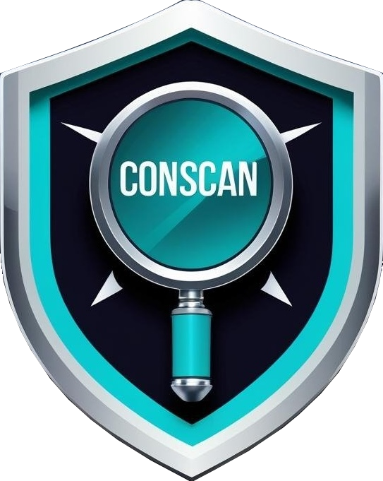

    

# Conscan
**Secure, lean, and compliant containers made simple.**

Scans a container image for`vulnerabilities`, `exposed secrets`, `inefficient file storage`, `OS packages and software dependencies in use (SBOM)` and `check CIS(Center for Internet Security) Benchmarks`.

# 📖 Introduction

Conscan is a lightweight yet powerful container image scanning tool that helps you secure and optimize your container workloads.
It analyzes container images for potential security risks, misconfigurations, and inefficiencies—giving developers and DevOps teams actionable insights before deploying to production.

With conscan, you can:

- Detect vulnerabilities in OS packages and application dependencies.
- Identify exposed secrets inside images.
- Generate SBOM (Software Bill of Materials) for transparency and compliance.
- Spot inefficient file storage that bloats images.
- Validate container security against CIS Benchmarks.
- Export results in JSON, table, or HTML formats for easy integration and reporting.
- Scan both local images and images from remote registries (e.g., Docker Hub).
- By integrating conscan into your CI/CD pipeline, you can shift security left and ensure your containers are secure, lean, and compliant from the very beginning.

# 💡 Motivation

There are already great security tools like Trivy, Grype, and Syft — so why build conscan?

While working with containerized applications, I noticed a few gaps when using these tools individually:

- 🔀 Fragmented Workflows → Each tool specializes in one area (vulnerabilities, SBOM, secrets, CIS), which often requires juggling multiple commands and parsing different outputs.

- 📑 Inconsistent Reporting → Output formats and structures vary between tools, making it harder to integrate results into CI/CD pipelines or share with teams.

- 🖥 Developer Experience → New users often struggle with setup, remembering CLI flags, and combining results from multiple scanners.

- 📦 One-stop Scanning → Sometimes you just want to run a single command against an image and get everything — vulnerabilities, SBOM, secrets, CIS checks, and efficiency hints.

Conscan was built to address these pain points by:

- Providing a unified interface to multiple best-in-class scanners.
- Normalizing results into consistent outputs (table, JSON, HTML).
- Supporting both local and remote images seamlessly.
- Focusing on developer-first usability and CI/CD integration.

In short:
👉 Conscan doesn’t try to reinvent the wheel — it puts the best wheels together on one car. 🚗💨

# ✨ Features
### 🔍 Vulnerability Scanning
Scans OS packages and software dependencies against known vulnerabilities.

### 🔑 Secret Detection
Detects API keys, tokens, and other sensitive information accidentally embedded in images.

### 📦 SBOM Generation
Produces a detailed Software Bill of Materials for visibility into components in use.

### 📂 Storage Efficiency Analysis
Highlights large or unnecessary files that increase image size.

### 🛡 CIS Benchmark Checks
Validates images against Center for Internet Security (CIS) recommendations.

### 📝 Flexible Report Formats
Supports JSON, table, and HTML outputs for automation, human readability, and sharing.

### 🖥 Local & Remote Image Support
Works with images stored locally or pulled directly from remote registries like Docker Hub.

### ⚡ Fast & CI/CD Friendly
Designed to be easily integrated into build pipelines with minimal overhead.

# 🛠 Powered By

Conscan leverages well-established open-source security and compliance tools under the hood, combining their strengths into a single unified workflow:

- [Trivy](https://github.com/aquasecurity/trivy) → Vulnerability scanning, secret detection, and misconfigurations
- [Grype](https://github.com/anchore/grype) → Deep vulnerability scanning of OS packages and application dependencies
- [Syft](https://github.com/anchore/syft) → SBOM (Software Bill of Materials) generation
- [Dive](https://github.com/wagoodman/dive) → Check inefficient files by discovering ways to shrink the size of your Docker/OCI image.
- [Dockle](https://github.com/goodwithtech/dockle) → Container Image Linter for Security, Check CIS Benchmarks 

By orchestrating these tools behind the scenes, conscan provides a streamlined developer experience with consistent reporting, multiple output formats, and optional CIS benchmark validation.

# Quick Start

# 📊 Report Formats

Conscan supports multiple output formats to fit different workflows:

- Table → Human-readable in CLI
- JSON → For integration with pipelines & automation
- HTML → Shareable reports for teams and auditors